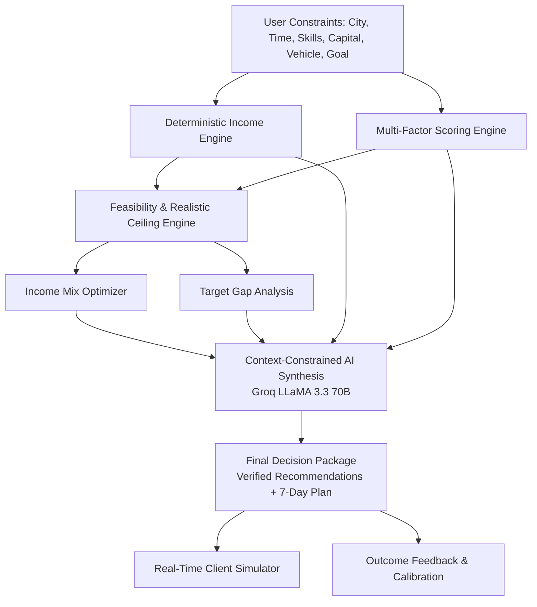

# DailyEarn AI: Hyper-Local Daily Income Decision Engine for Bharat

[](https://www.typescriptlang.org/)
[](https://vitejs.dev/)
[](https://react.dev/)
[](https://expressjs.com/)
[](https://orm.drizzle.team/)
[](https://www.postgresql.org/)
[](https://groq.com/)
[](https://vitest.dev/)

> **Product Positioning:**
> *"An AI-powered hyper-local daily income decision engine for Bharat that converts a user's location, skills, available time, target income, and constraints into realistic, verified, math-backed, executable income plans."*

---

## 🌟 Why DailyEarn AI Stands Apart

Most "AI earning tools" act like generic conversational wrappers: asking an LLM to hallucinate side-hustles with fabricated ₹ earning numbers and zero concept of vehicle requirements, fuel costs, platform commissions, or time constraints.

**DailyEarn AI rejects that paradigm entirely:**

```
❌ Traditional AI Prototype:
User: "I want to earn ₹800/day in Silchar."
LLM: "Here are 5 ideas: Dropshipping, Cloud Kitchen, YouTube Channel, AI Consulting, Freelancing."
(Zero math, zero deduction analysis, unrealistic capital, no vehicle check).

✅ DailyEarn AI Decision Engine:
User: "Silchar | Teaching | 4 hours/day | ₹0 Capital | No Vehicle | Goal: ₹800/day"
DailyEarn:
1. FEASIBLE VERDICT: Yes, realistic ceiling is ₹650 – ₹950/day.
2. DETERMINISTIC NET MATH: 2.4 sessions × ₹350/session = ₹840 gross − ₹0 fee − ₹40 commute = ₹800 net/day.
3. CONFIDENCE SCORE: 88% based on verified local tutoring benchmarks in Assam.
4. WHY RANKED #1: Match score 92/100 (high local student density, zero capital required, fits walking commute).
5. 7-DAY ACTION PLAN: Day 1 KYC & student radius map → Day 3 first trial session → Day 7 revenue review.
6. TARGET SHORTFALL SIMULATOR: If available time drops to 2h/day, the engine recalculates to "POSSIBLE WITH CHANGES", quantifies the ₹350/day shortfall, and suggests a dual-stream Income Mix.
```

---

## 🧠 Architectural Pillars



### 1. Zero-Hallucination Financial Math (`backend/src/engines/incomeEngine.ts`)
The LLM is **strictly forbidden** from performing financial arithmetic or inventing platform fees. Every rupee is calculated deterministically in TypeScript:
$$\text{Gross Daily} = \text{Units Completed/Day} \times \text{Payout Per Unit}$$
$$\text{Net Daily} = \text{Gross Daily} - \text{Platform Commission} - \text{Dynamic Fuel} - \text{Materials}$$
$$\text{Dynamic Fuel Cost} = \left(\frac{\text{Daily Travel Distance (km)}}{\text{Vehicle Mileage (km/L)}}\right) \times \text{Fuel Price/Liter}$$
- **Delivery / Transport**: Dynamic fuel equation (default petrol: ₹102/L, 48 km/L motorcycle / 38 km/L scooter; electric 2W ~₹0.35/km; bicycle: ₹0) with transparent disclosure.
- **Home Tiffin / Kitchen**: Accounts for 42% raw grocery ingredients and disposable packaging.
- **Tutoring / Typing / Service**: Accounts for walking/bus commute allowances and material wear.
- **Calculation Status**: Tagged as `MODELLED`, `DIRECT`, `PARTIALLY_MODELLED`, or `INSUFFICIENT_DATA`.

### 2. Explainable 8-Factor Heuristic Scoring (`scoringEngine.ts`)
Transparent weighted scoring formula with configurable weights:
- **Skill Fit (20%)**: Exact matches vs beginner-accessible tasks.
- **Location Fit (15%)**: Pan-India vs Tier-2/3 localized demand.
- **Time Fit (15%)**: Strict penalty if required unit duration exceeds available working hours.
- `FEASIBLE`: Best net earnings meet or exceed the target.
- `POSSIBLE_WITH_CHANGES`: Achievable with +1 to 2 extra hours, dual-stream mixing, or price adjustment.
- `UNLIKELY`: Target exceeds the realistic economic ceiling of local informal micro-work.

### 4. Target Gap Levers: User-Specific Realism Scoring (`targetGapEngine.ts`)
When a single opportunity cannot bridge the user's target within available hours, the engine deterministically scores every gap-closing scenario (0–100 Realism) tailored to the **current user's constraints**, with explicit provenance:
- **Hours Extension (`MODELLED ESTIMATE`)**: Realism reflects mathematical capacity from current hours; disclaims individual health, endurance, or fatigue.
- **Premium Pricing / Batching (`HEURISTIC ASSUMPTION`)**: Scored by experience leverage; explicitly disclaims guaranteed rates (35% scenario is a modelled heuristic).
- **Dual-Stream Income Mix (`USER-SPECIFIC INFERENCE`)**: Ranks #1 for users with two declared skills; disclaims that execution requires active schedule coordination.
- **Secondary Micro-Skill Ramp (`HEURISTIC ASSUMPTION`)**: Disclaims fixed timelines (training time is uncertain and treated as a modelled estimate).
- **Two-Wheeler Mobility (`MODELLED ESTIMATE`)**: Vehicle access may unlock vehicle-dependent platforms; financing, rental, availability, and earnings remain modelled estimates.
*(No fixed universal ranking: rankings dynamically adapt per user profile; no unsupported assumptions are presented as facts).*

### 5. Interactive Real-Time Simulator (`IncomeSimulatorModal.tsx`)
Users can interactively tweak working hours (1–12h), completed units/hour, pricing, and fuel costs with **instant zero-latency client-side recalculations** of Net Daily, Weekly, Monthly, and Target Gap.

### 6. Ground-Truth Calibration & Outcome Feedback (`userOutcomes.ts`)
Users report back after attempting tasks:
- Actual ₹ earned vs. predicted ₹
- Actual hours spent and real costs incurred
- Accuracy rating ($\pm 20\%$)
- Aggregated live telemetry displayed in the `/analytics` dashboard.

---

## 🏆 National Competition Hero Demo

To demonstrate the engine's intelligence live to judges:
1. Open the dashboard.
2. Click the top bar **"🏆 JUDGE DEMO MODE"**.
3. **Scenario A (4 Hours/day)**:
   - City: `Silchar, Assam` | Skills: `Teaching` | Available Time: `4 hrs` | Target: `₹800/day`
   - **Verdict**: `TARGET FEASIBLE`
   - **Realistic Ceiling**: `₹600 – ₹900/day`
   - **Rank #1**: Private Home Tutoring (Net: ~₹800/day, Score: 92/100)
4. Click **"Test 2 Hours/day"**:
   - **Dynamic Recalculation**: Time drops from 4h to 2h.
   - **Verdict Shifts**: Instantly switches to `POSSIBLE WITH ADJUSTMENTS`.
   - **Target Shortfall**: Displays shortfall of `−₹350/day`.
   - **Actionable Levers**: Recommends adding 1.5 hours or activating the Dual-Stream Income Mix.

---

## 📂 Repository Layout

```
├── backend/
│   ├── src/
│   │   ├── config/            # env validation, database pool, Redis, Groq LLaMA
│   │   ├── db/
│   │   │   ├── schema/        # users, opportunities, recommendations, executionPlans, userOutcomes
│   │   │   └── seeds/         # 14 authentic verified Indian opportunities
│   │   ├── engines/           # DETERMINISTIC CALCULATION ENGINES
│   │   │   ├── incomeEngine.ts          # Gross, Net, Deductions, Ranges, Formulas
│   │   │   ├── scoringEngine.ts         # Explainable 0-100 Multi-Factor Scoring
│   │   │   ├── feasibilityEngine.ts     # FEASIBLE, POSSIBLE_WITH_CHANGES, UNLIKELY
│   │   │   ├── confidenceEngine.ts      # Data freshness, positive drivers, risk factors
│   │   │   ├── incomeMixOptimizer.ts    # Dual-stream compatible micro-work bundles
│   │   │   ├── targetGapEngine.ts       # "What would it take" actionable levers
│   │   │   └── executionPlanEngine.ts   # 7-day personalized milestone checklists
│   │   ├── modules/
│   │   │   ├── auth/          # O(1) SHA-256 session auth, token rotation, cookies
│   │   │   ├── decision/      # Decision orchestration, simulator API, outcome tracking
│   │   │   ├── ideas/         # Legacy idea generation
│   │   │   └── locations/     # OpenStreetMap Nominatim geocoding
│   │   └── server.ts          # Express 5 entry point & route mounting
│   └── package.json
│
├── frontend/
│   ├── src/
│   │   ├── components/
│   │   │   ├── app/           # FeasibilityBanner, RecommendationCard, IncomeMixCard,
│   │   │   │                  # IncomeSimulatorModal, SevenDayPlanDrawer, TrustCenterModal,
│   │   │   │                  # OutcomeFeedbackModal, GenerateBar
│   │   │   ├── demo/          # CompetitionHeroDemo (1-click Silchar case study)
│   │   │   ├── layout/        # Navbar with Telemetry link, PageWrapper
│   │   │   └── three/         # ParticleField (Three.js dynamic background)
│   │   ├── pages/             # DashboardPage, AnalyticsPage, LandingPage, Auth
│   │   ├── store/             # Zustand decisionStore, authStore
│   │   └── types/             # Full TypeScript contracts
│   └── package.json
```

---

## ⚡ Quickstart & Verification

### Prerequisites
- Node.js 18+
- PostgreSQL & Redis (or run via Docker Compose)

### 1. Install Dependencies
```bash
# Backend
cd backend
npm install

# Frontend
cd ../frontend
npm install
```

### 2. Run Test Suites
```bash
cd backend
npm test
```
*Executes all 34 unit tests across auth, locations, deterministic engines, and decision service in < 900ms.*

### 3. Verify TypeScript Typechecks
```bash
# Backend
cd backend && npm run typecheck

# Frontend
cd ../frontend && npm run typecheck
```

### 4. Build Production Bundles
```bash
# Backend
cd backend && npm run build

# Frontend
cd ../frontend && npm run build
```

### 5. Launch Development Servers
```bash
# Terminal 1: Backend
cd backend && npm run dev

# Terminal 2: Frontend
cd frontend && npm run dev
```

---

## 🚀 Render Deployment Guide (Turnkey Monorepo Setup)

The repository is pre-configured for instant deployment on [Render](https://render.com) using either the included `render.yaml` blueprint or manual dashboard setup.

### A. RENDER FRONTEND (Static Site)
| Field | Value |
|---|---|
| **Service Type** | Static Site |
| **Name** | `dailyearn-frontend` |
| **Root Directory** | `frontend` |
| **Build Command** | `npm install && npm run build` |
| **Publish Directory** | `dist` |
| **SPA Fallback** | Handled automatically via `frontend/public/_redirects` (`/* /index.html 200`) |
| **Environment Variable** | `VITE_API_URL`: URL of your backend service (e.g., `https://dailyearn-backend.onrender.com`) |

### B. RENDER BACKEND (Web Service)
| Field | Value |
|---|---|
| **Service Type** | Web Service |
| **Name** | `dailyearn-backend` |
| **Runtime** | `Node` |
| **Root Directory** | `backend` |
| **Build Command** | `npm install && npm run build` |
| **Start Command** | `node dist/server.js` |
| **Health Check Path** | `/api/health` |
| **Auto-Deploy** | `Yes` (on push to `main`) |

#### Required Backend Environment Variables
| Variable Name | Description | Example / Source |
|---|---|---|
| `NODE_ENV` | Environment mode | `production` |
| `PORT` | Web port | Auto-provided by Render (server binds to `0.0.0.0`) |
| `DATABASE_URL` | PostgreSQL connection string | From Render Managed PostgreSQL |
| `REDIS_URL` | Redis connection string | From Render Redis or fallback |
| `GROQ_API_KEY` | Groq LLaMA 3.3 API key | Secret key from groq.com |
| `JWT_ACCESS_SECRET` | 64+ char random secret for access tokens | Random string |
| `JWT_REFRESH_SECRET` | 64+ char random secret for refresh tokens | Random string |
| `BCRYPT_ROUNDS` | Password hashing work factor | `12` |
| `CORS_ORIGIN` | Allowed frontend origin | `https://dailyearn-frontend.onrender.com` |
| `ADMIN_SECRET` | 32+ char secret for administrative actions | Random string |

### C. DATABASE & SEED STRATEGY
- **Managed PostgreSQL**: Add a free or starter PostgreSQL database on Render.
- **Automatic Idempotent Seeding**: The server automatically seeds the 14 verified Indian opportunities into the database on startup using `.onConflictDoNothing()`. It never overwrites existing records or wipes user data.
- **Graceful Redis Degradation**: If Redis restarts or is temporarily unavailable, rate limiting and session caching fall back gracefully to in-memory storage, keeping the health check probe (`/api/health`) green (HTTP 200).

---

## 📜 Verified Ground-Truth Sources
- **Swiggy Delivery Partner Terms (2024)**: ₹40–₹65 base/order, fuel @ ₹3.50/km.
- **Meesho Reseller Program**: 10–25% realized customer margins on apparel/home goods.
- **Urban Company Professional Network**: 18% standard platform service fee.
- **UrbanPro & Neighborhood Tutoring Benchmarks**: ₹250–₹450/hour across Tier-2/3 Indian cities.
- **FSSAI Home Kitchen Operator Compliance**: 35–45% raw grocery and packaging cost baseline.

---

## ⚖️ Disclaimer
*Earnings projections generated by DailyEarn AI are statistical and econometric estimates based on verified partner terms and regional cost benchmarks, not legal guarantees of income. Real-world earnings vary based on localized demand, platform dispatch algorithms, individual execution, and operational conditions.*
