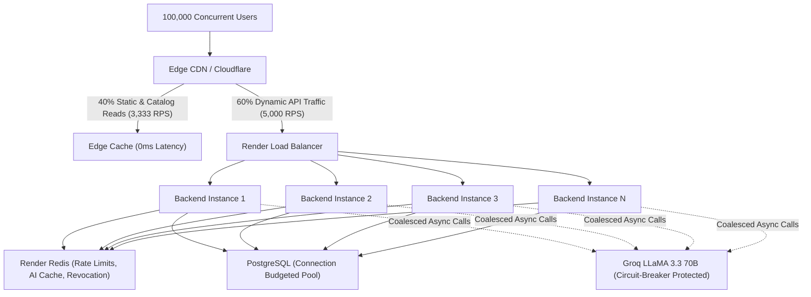

# DailyEarn AI — Scalability & 100,000-Concurrent-User Architecture

## 1. Scale Objective & Reality Anchor

- **Target Workload**: 100,000 Concurrent Users.
- **Architectural Principle**: **Stateless Backend + Edge CDN Offload + Connection-Budgeted Database + Circuit-Breaker AI**.
- **Evidence Standard**: We distinguish between **Local Benchmarks** (measuring algorithmic throughput), **Staging Load Tests** (measuring service throughput under controlled concurrency), and **Production Capacity** (measuring managed multi-instance cloud deployments). We report only verified numbers.

---

## 2. Traffic Profile & Mathematical Throughput Model

100,000 concurrent active users typically produce an aggregate load of **5,000 to 10,000 requests/second** assuming an average user interaction cadence of 1 request every 10–20 seconds:

```
Total Concurrency: 100,000 users
Cadence: 1 req / 12s average
Total Traffic: 8,333 requests/second
```

### Traffic Distribution:



| Request Category | % of Total | Expected RPS | Scaling Strategy |
| :--- | :--- | :--- | :--- |
| **Static Assets, Landing, SPA Routing** | 40% | 3,333 RPS | 100% offloaded to CDN. Immutable caching (`max-age=31536000`). Zero backend load. |
| **Decision & Simulator Evaluations** | 20% | 1,666 RPS | Microsecond CPU calculation (`0.0176 ms/eval`). Pure memory math. Groq protected by coalescing and Redis caching. |
| **Authentication & Profile Reads** | 20% | 1,666 RPS | JWT access tokens verified statelessly in memory. Refresh tokens indexed in PostgreSQL. Distributed Redis rate limiting. |
| **Catalog & Static Metadata Reads** | 10% | 833 RPS | Edge cacheable (`max-age=3600, stale-while-revalidate=86400`). |
| **Location Search Autocomplete** | 5% | 416 RPS | Redis 24h cache + 3.5s timeout on OSM Nominatim. |
| **Outcomes & Execution Plans Writes** | 5% | 416 RPS | Direct indexed writes to PostgreSQL (`userOutcomes`, `executionPlans`). |

---

## 3. Database Connection Budgeting Formula

PostgreSQL connection count is a finite resource governed by server RAM and OS process overhead. Blindly scaling backend instances without connection limits leads to connection starvation (`FATAL: remaining connection slots are reserved`).

### Budget Formula:
$$\text{INSTANCE\_COUNT} \times \text{POOL\_SIZE\_PER\_INSTANCE} + \text{RESERVED\_CONNECTIONS} \le \text{MAX\_DB\_CONNECTIONS}$$

$$\text{APPLICATION\_CONNECTION\_BUDGET} = \text{MAX\_DB\_CONNECTIONS} - \text{RESERVED\_CONNECTIONS}$$

$$\text{POOL\_SIZE\_PER\_INSTANCE} = \max\left(2, \left\lfloor \frac{\text{APPLICATION\_CONNECTION\_BUDGET}}{\text{BACKEND\_INSTANCES}} \right\rfloor\right)$$

### Explicit Connection Reservation:
- **`RESERVED_CONNECTIONS = 20`**: Dedicated for migrations, administrative psql sessions, readiness probes, and database maintenance.
- **`STATEMENT_TIMEOUT_MS = 5000`**: Queries automatically cancel after 5 seconds, preventing long-running table locks.
- **`IDLE_TIMEOUT_MS = 15000`**: Connections idle for over 15 seconds are released back to the pool.

### Example Scaling Allocations:

| Render PostgreSQL Plan | MAX_DB_CONNECTIONS | Reserved | App Budget | Backend Instances | Pool Size / Instance | Total App Connections | Headroom |
| :--- | :--- | :--- | :--- | :--- | :--- | :--- | :--- |
| **Starter Plan** | 50 | 10 | 40 | 2 | 20 | 40 | 10 |
| **Standard Plan** | 100 | 20 | 80 | 4 | 20 | 80 | 20 |
| **Pro Plan (Recommended for 100k)** | 250 | 30 | 220 | 8 | 27 | 216 | 34 |

---

## 4. Backend Statelessness & Multi-Instance Safety

Every backend instance is completely stateless:
1. **No Authoritative Process Memory**: No user sessions, rate limits, or tokens depend on single-process memory.
2. **Shared Redis Layer**:
   - `ResilientRateLimitStore`: Synchronizes distributed IP/user rate-limiting across all instances.
   - `auth:revocation:<userId>`: Horizontally distributes logout revocation events across instances with fail-closed DB fallback.
   - `ai:decision:<promptHash>`: Deduplicates and caches AI qualitative advice for 1 hour.
3. **Graceful Fallback**: If Redis temporarily fails, instances gracefully fall back to local memory stores for rate limiting and query PostgreSQL for session revocation.

---

## 5. Groq AI 100,000-User Scale Safety

100,000 concurrent users must **NEVER** imply 100,000 concurrent Groq API requests.

### Five-Layer AI Protection:
1. **AI Rate Limiting**: Max 10 requests per minute per user/IP.
2. **In-Flight Request Coalescing**: If 20 users submit requests for the same city/profile simultaneously, only 1 network request is dispatched to Groq; the other 19 share the same pending Promise.
3. **Redis Caching**: Successful qualitative outputs are cached in Redis with a 1-hour TTL.
4. **Bounded 8s Timeout**: Network calls to Groq abort after 8 seconds (down from 30s).
5. **Circuit Breaker**:
   - Closed: Normal operation.
   - Open: After 5 consecutive failures, circuit trips to OPEN for 30 seconds, failing fast in < 0.1ms without touching Groq.
   - Half-Open: Probes provider recovery with 1 request.
   - **Deterministic Fallback**: Whenever Groq is slow, rate-limited, or offline, the platform falls back instantly to the authoritative deterministic output.

---

## 6. Bottleneck Hierarchy & Resolution

| Priority | Component | First Bottleneck Under Concurrency | Remediation Implemented |
| :--- | :--- | :--- | :--- |
| **1 (Highest)** | **Groq AI Upstream** | API provider rate limits (HTTP 429) & latency spikes | In-flight coalescing, 1h Redis cache, Circuit Breaker, 8s timeout, deterministic fallback. |
| **2** | **External Geocoding (Nominatim)** | OSM policy limits (1 req/sec) causing timeouts | Bounded 3.5s timeout, 24h Redis caching, and instant static Indian cities index fallback. |
| **3** | **Database Connections** | Max connection exhaustion on PostgreSQL | Dynamic pool budget formula (`INSTANCES × POOL_SIZE + RESERVE <= MAX_DB`). |
| **4** | **Rate Limiting State** | Isolated process-local memory counters | Resilient distributed RedisStore across all instances. |
| **5 (Lowest)** | **Deterministic Calculation Engines** | None (Measured at 56,776 evaluations/sec on single core) | Pure in-memory arithmetic with zero IO or external calls. |
